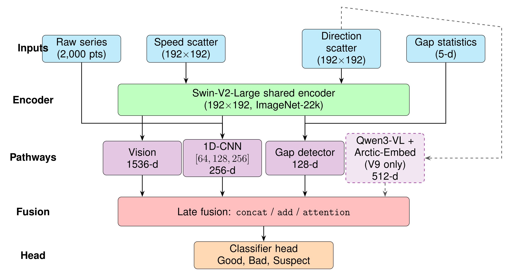
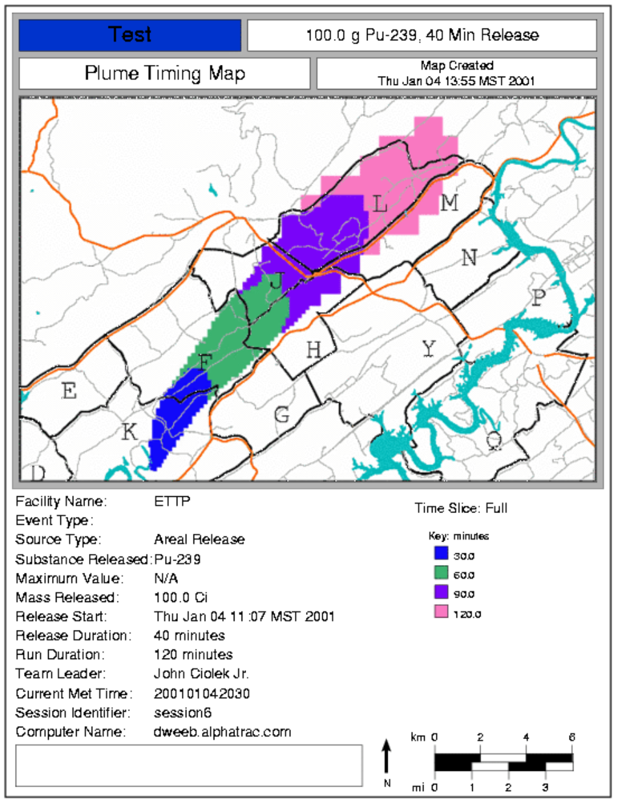
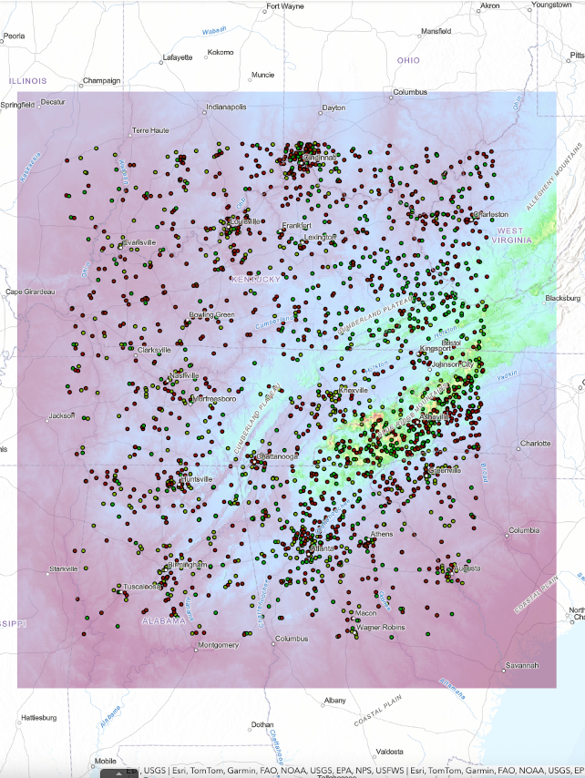
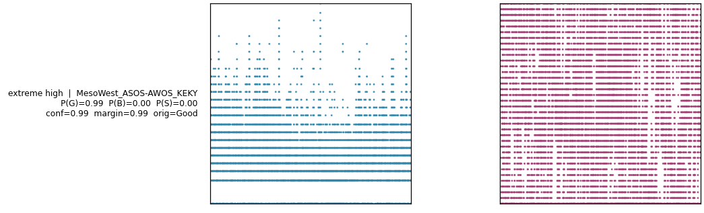
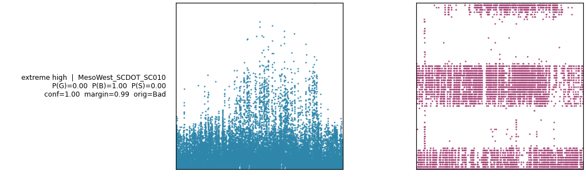
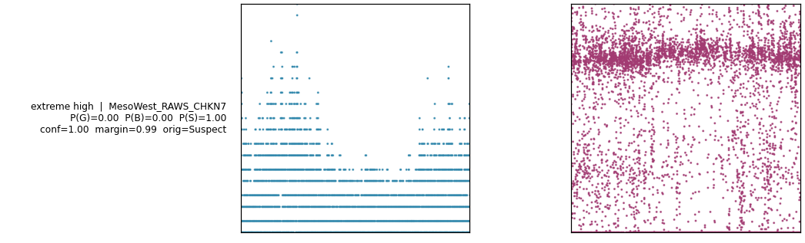
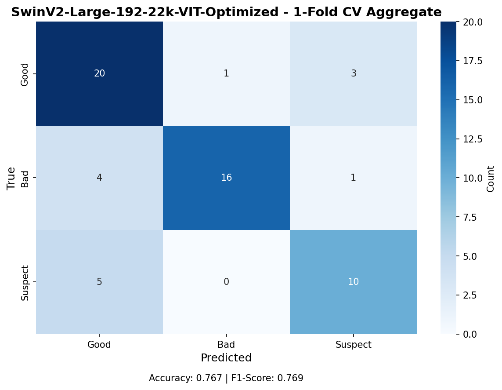
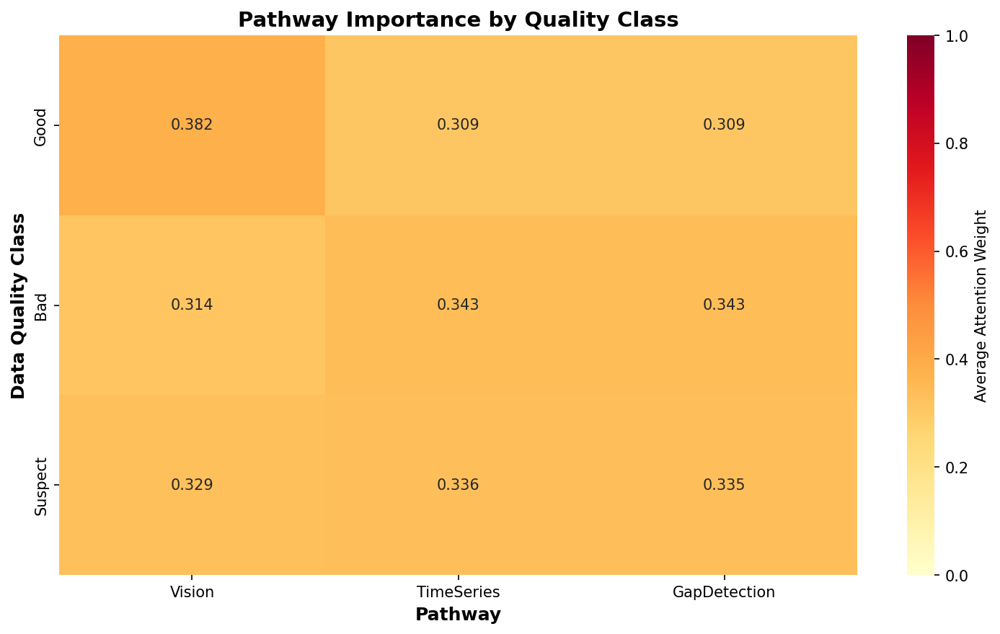
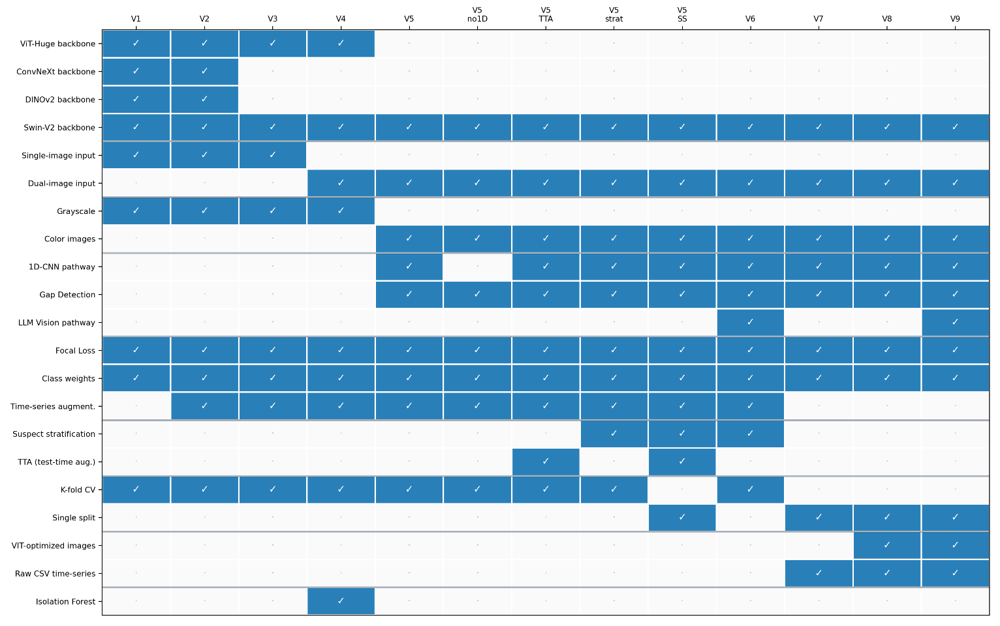
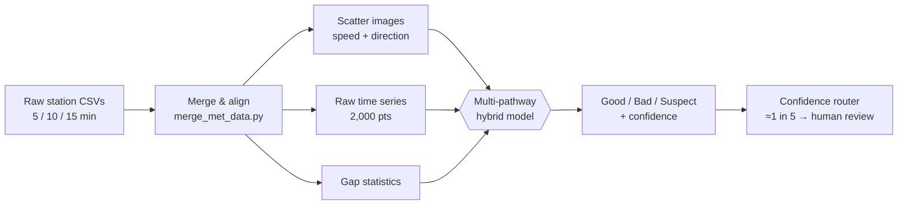

<div align="center">

# 🌦️ CAPARS Automated Quality Assurance

### A Multi-Pathway Hybrid Vision Transformer for Meteorological Station Data

*Automated Good / Bad / Suspect classification of wind-station records for atmospheric dispersion modeling at DOE laboratories.*

[](https://www.python.org/)
[](https://pytorch.org/)
[](https://huggingface.co/docs/transformers)
[](https://hub.docker.com/r/jtupayac/nsrd-ui)
[](#-citation--contact)



</div>

---

## 📑 Table of Contents

- [Overview](#-overview)
- [Why it matters](#-why-it-matters)
- [Architecture](#-architecture)
- [What the model sees](#-what-the-model-sees)
- [Dataset](#-dataset)
- [Results](#-results)
- [Model iterations (V8 vs. V9)](#-model-iterations-v8-vs-v9)
- [Pipeline](#-pipeline)
- [Getting started](#-getting-started)
- [Project structure](#-project-structure)
- [Citation & contact](#-citation--contact)

---

## 🚀 Overview

**CAPARS** builds the 3-D wind fields that drive **emergency plume-dispersion**
projections at DOE laboratories. A single faulty sensor propagates directly into
those wind fields — corrupting plume direction, concentration, arrival time, and
dose estimates in a **safety-critical** setting.

Today, analysts hand-label every station as
**🟢 Good**, **🔴 Bad**, or **🟡 Suspect** — a process that is labor-intensive,
subjective, and hard to scale across networks of thousands of stations.

This project replaces that bottleneck with a **multi-pathway hybrid vision
transformer** that classifies hundreds of stations in a single GPU pass, with a
tunable, confidence-aware human-review queue.

| | |
|---|---|
| 🎯 **Task** | 3-class QA: Good / Bad / Suspect |
| 🧠 **Backbone** | SwinV2-Large + 1D-CNN + gap detector (+ optional Qwen3-VL) |
| 📈 **Best result** | Macro **F₁ = 0.769** on the held-out set |
| 🌍 **Scale** | 394 labeled + **2,196 unlabeled** stations scored |

---

## 💡 Why it matters

<div align="center">

&nbsp;&nbsp;

</div>

<div align="center">
<sub><b>Left:</b> sensor errors shift the CAPARS plume direction, concentration, and arrival timing. &nbsp;
<b>Right:</b> the data challenge — thousands of stations spanning two DOE networks with heterogeneous terrain.</sub>
</div>

Traditional threshold tests miss the critical **Suspect** class: records that look
plausible but hide subtle **temporal anomalies**. Catching these is exactly where a
learned, multi-pathway model shines.

---

## 🏗️ Architecture

<div align="center">

</div>

The model fuses **four complementary streams**, then concatenates their features for
a single Good / Bad / Suspect decision:

| Pathway | Input | Role |
|---------|-------|------|
| 👁️ **Vision** | Two 192×192 scatter images (speed + direction) | SwinV2-Large backbone; best on clean **Good** records |
| 📉 **1D-CNN** | Raw 2,000-point time series | Captures fine-grained temporal artifacts |
| 🕳️ **Gap detector** | Five missing-data gap statistics | Flags dropout / stuck-sensor patterns |
| 🗣️ **LLM (optional)** | Qwen3-VL embeddings | Domain-invariant cues that unlock **cross-site transfer** |

> **Key design choice.** Adding **wind direction** as a second scatter image yields
> **+11.9 pp** macro F₁ — the single largest improvement in the study.

---

## 🔍 What the model sees

One real station per class (wind-speed / wind-direction scatter):

| 🟢 Good | 🔴 Bad | 🟡 Suspect |
|:---:|:---:|:---:|
|  |  |  |
| Clean diurnal cycle | Flat-line / spike artifacts | Direction stuck; subtle anomaly |

---

## 📊 Dataset

| Metric | Value |
|--------|-------|
| **Labeled stations** | 394 — Site O: 221 (heterogeneous) · Site L: 173 (milder terrain) |
| **Unlabeled scored** | 2,196 Site O stations |
| **Per-station inputs** | 2 scatter images · 2,000-pt time series · 5 gap statistics |
| **Classes** | 🟢 Good · 🔴 Bad · 🟡 Suspect |
| **Data source** | Meteorological tower networks at Oak Ridge (Site O) & Los Alamos (Site L) National Laboratories, feeding CAPARS |

---

## 🏆 Results

<div align="center">

&nbsp;&nbsp;

</div>

<div align="center">
<sub><b>Left:</b> hold-out confusion — all error is Good↔Suspect; <b>Bad</b> recall 76%, rarely confused. &nbsp;
<b>Right:</b> mean attention weight per pathway — Vision drives <b>Good</b>, 1D-CNN + Gap drive <b>Bad</b>/<b>Suspect</b>.</sub>
</div>

### Ablation study (macro F₁ and per-class F₁)

| Configuration | F₁ | Good | Bad | Suspect |
|---|:--:|:--:|:--:|:--:|
| Full (4 pathways) | .730 | .766 | .762 | .636 |
| − Time series (1D-CNN) | .733 | .771 | .765 | .638 |
| − Gap detector | .727 | .766 | .775 | .610 |
| Vision only | .723 | .767 | .752 | .626 |
| Class-weight loss | .715 | .752 | .755 | .609 |
| Two-stage head | .737 | .766 | .771 | .653 |
| **No sampler (V8)** | **.752** | **.780** | **.780** | **.675** |

### Final hold-out & domain transfer

| Model / protocol | Macro F₁ | Suspect F₁ | Accuracy |
|---|:--:|:--:|:--:|
| **V8 vision** (within-site) | **.769** | .690 | .767 |
| V9 + LLM (within-site) | .759 | .640 | .767 |
| V9 + LLM (Site L → Site O) | **+4.4 pp** vs. V8 | — | — |

- ✅ **V8** achieves the best overall macro F₁ = 0.769 (Vision + 1D-CNN + Gap) and excels at **Bad** detection.
- ✅ **V9's LLM pathway** earns its keep on **cross-site transfer** (+4.4 pp macro F₁).
- ✅ **Site L > Site O**: terrain heterogeneity drives higher variance at Site O.

---

## 🔁 Model iterations (V8 vs. V9)

<div align="center">

</div>

**V8** uses three pathways (Vision + 1D-CNN + Gap). **V9** adds a fourth
Qwen3-VL LLM pathway: in-domain performance is statistically tied, but cross-site
generalization improves thanks to domain-invariant embeddings.

---

## 🛠️ Pipeline



**Image preprocessing** (OpenCV): grayscale → 3-channel → resize to backbone input
(SwinV2 384×384) → ImageNet normalization → tensor. No augmentation, to preserve
temporal structure.

---

## ⚡ Getting started

### Requirements

```text
torch>=2.0        transformers        opencv-python
numpy             pandas              scikit-learn
matplotlib        seaborn             tqdm            pyarrow
```

```bash
pip install torch transformers opencv-python numpy pandas \
            scikit-learn matplotlib seaborn tqdm pyarrow
```

### 1 · Merge & align raw data

```bash
python merge_met_data.py
```

### 2 · Train the multi-pathway models

```bash
# baseline
nohup python3 multi_model_training.py    > training_log.txt   2>&1 &

# subsequent iterations
nohup python3 multi_model_trainingv2.py  > training_logv2.txt 2>&1 &
nohup python3 multi_model_trainingv3.py  > training_logv3.txt 2>&1 &   # suspect ensemble
nohup python3 multi_model_trainingv4     > training_logv4.txt 2>&1 &
```

Each run produces per-fold confusion matrices, classification reports (JSON),
prediction CSVs, and an aggregated K-fold summary with mean ± std.

### 3 · Try the app

A packaged UI is available on Docker Hub:

```bash
docker pull jtupayac/nsrd-ui
```

---

## 📁 Project structure

```text
ONRL_ENCODER_DECODER_CAPARS/
├── merge_met_data.py              # Data merging & 5-min alignment
├── create_metadata.py            # Station metadata
├── eda_met_data.py               # Exploratory data analysis
├── trim_images.py                # Crop scatter plots to content
├── multi_model_training.py       # V1 multi-pathway training
├── multi_model_trainingv2.py     # V2
├── multi_model_trainingv3.py     # V3 — suspect-class ensemble
├── multi_model_trainingv4        # V4
├── lstm_masked_autoencoder.py    # LSTM baseline (encoder–decoder)
├── tcn_masked_autoencoder.py     # TCN baseline with learnable masks
├── assets/                       # README figures
├── model_outputs_v8_FINAL_*/     # V8 checkpoints & predictions
├── model_outputs_v9_*/           # V9 (+LLM) checkpoints & predictions
└── 6a63c1ca97e84746ad3747bf/     # Conference poster (LaTeX)
```

<details>
<summary>📦 Baseline encoder–decoder models (LSTM / TCN)</summary>

Earlier iterations framed QA as **reconstruction-based anomaly detection**: train an
autoencoder on Good data only, then flag records with high masked-MSE reconstruction
error.

- **LSTM autoencoder** — BiLSTM encoder (2→128), 32-D latent, LSTM decoder.
- **TCN autoencoder** — dilated causal convolutions `[1,2,4,8,16]`, learnable mask
  layer, input mask module, and a masked-MSE loss over valid positions only.
- **Training** — 5-fold CV on Good data (70/15/15), RobustScaler normalization,
  ReduceLROnPlateau, early stopping.

These are retained as baselines; the multi-pathway hybrid transformer is the current
production approach.

</details>

---

## 📜 Citation & contact

If you use this work, please cite the accompanying paper and link this repository.

**Authors:** Jose Tupayachi¹, Kevin Birdwell¹, John Ciolek², Jeff Navarra²,
Xueping Li³, Xiao-Ying Yu¹˒\*
<sub>¹ Oak Ridge National Laboratory · ² Los Alamos National Laboratory · ³ University of Tennessee, Knoxville</sub>

| | |
|---|---|
| 📧 **Jose Tupayachi** | [jtupayachi@ornl.gov](mailto:jtupayachi@ornl.gov) |
| 📧 **Xiao-Ying Yu** *(corresponding author)* | [yuxiaoying@ornl.gov](mailto:yuxiaoying@ornl.gov) |
| 💻 **Code** | [github.com/jtupayachi/ONRL_ENCODER_DECODER_CAPARS](https://github.com/jtupayachi/ONRL_ENCODER_DECODER_CAPARS) |
| 🐳 **App** | [hub.docker.com/r/jtupayac/nsrd-ui](https://hub.docker.com/r/jtupayac/nsrd-ui) |

<div align="center">
<sub>Research supported by the Nuclear Safety Research and Development (NSR&D) program, sponsored by the NNSA Office of Environment, Health, Safety and Security (EHSS), U.S. Department of Energy (DOE).</sub>
</div>
